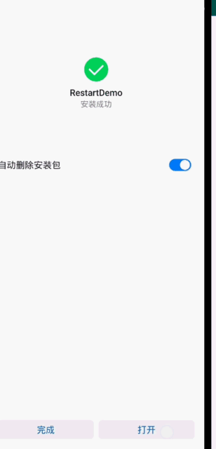
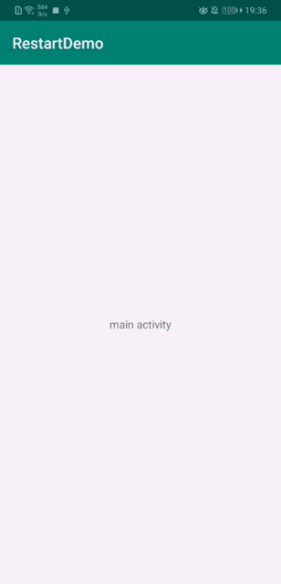

# Android Home键之后点击桌面icon重复启动应用问题
 

在启动app的时候，偶然间发现部分手机上每次应用点击home退到后台，再点击launcher上的图标重新进入，每次都会重新启动欢迎界面，然后再进入主界面。
## 基本流程
1. 启动：WelcomeActivity->MainActivity->OtherActivity 
2. home按下：应用退到后台 
3. 点击launcher图标启动应用：WelcomeActivity->MainActivity 
并没有按照预想那样，直接返回之前已经打开的页面。 

最后发现apk在通过部分手机系统安装器安装并打开之后，WelcomeActivity的Intent的flags是有差异的。 
所以导致上面应用重复启动原因是，安装器启动的应用，退到后台再返回前台，WelcomeActivity会多出一个FLAG_ACTIVITY_BROUGHT_TO_FRONT的flag。 
实际上已经是重新启动了WelcomeActivity，再由WelcomeActivity启动MainActivity，这个时候如果多次点击home再返回应用，是存在多个MainActivity的实例的
点击多次返回键就能看出问题。 

## 解决办法
所有做的处理就是启动WelcomeActivity时，判断这个WelcomeActivity是不是最初的，如果不是直接结束掉当前的WelcomeActivity，不要再让它走正常流程启动MainActivity。
使用Activity提供的isTaskRoot()方法，改方法会判断当前的Activity是根Activity，如果不是，就返回false。而当我们从后台返回前台时，由于之前已经存在了别的Activity，
这时应该返回false，如果满足情况，直接结束该Activity。

## license

   Copyright 2019 wjianchen13

   Licensed under the Apache License, Version 2.0 (the "License");
   you may not use this file except in compliance with the License.
   You may obtain a copy of the License at

       http://www.apache.org/licenses/LICENSE-2.0

   Unless required by applicable law or agreed to in writing, software
   distributed under the License is distributed on an "AS IS" BASIS,
   WITHOUT WARRANTIES OR CONDITIONS OF ANY KIND, either express or implied.
   See the License for the specific language governing permissions and
   limitations under the License.